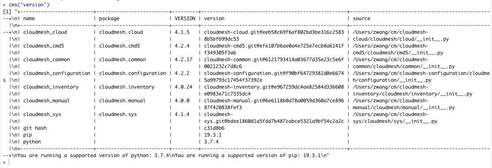

# Cloudmesh-R

The purpose of cloudmesh R command is to impletment CMS command in R environment.

## Getting Started

To get start, First, you need to set up R environment in your computer. 

There are two prerequisite packages before use the rcms package: 

1. reticulate

2. devtools

## Installing

```r
library(devtools)

install_github("cloudmesh/cloudmesh-r", subdir="rcms")

```

## Running Examples 

```r
library(rcms)

rcms("version")
```



## Acknowledgements
This project is the very step of implement CMS in R. More devlopment is needed 